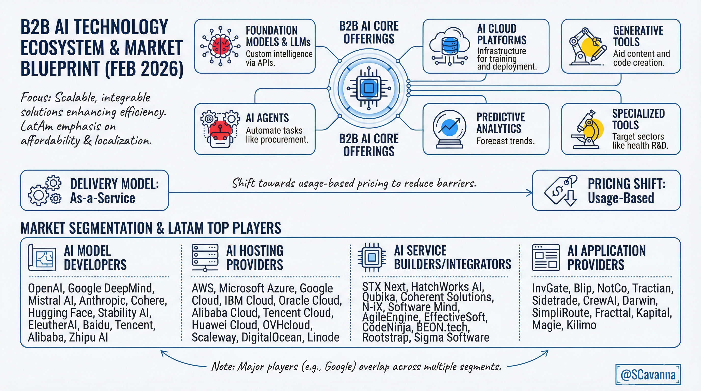
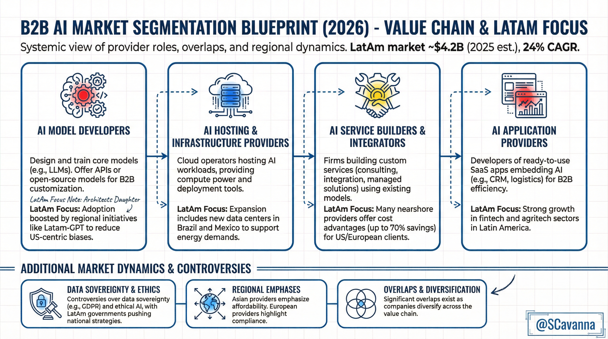
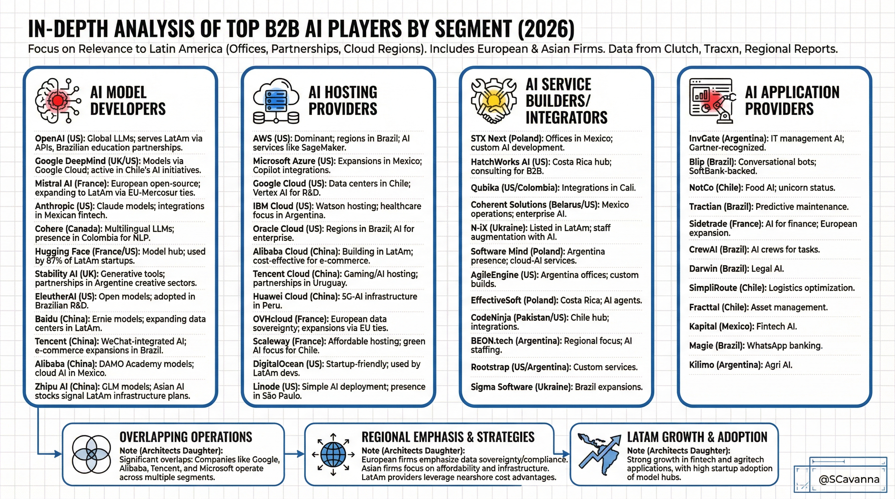
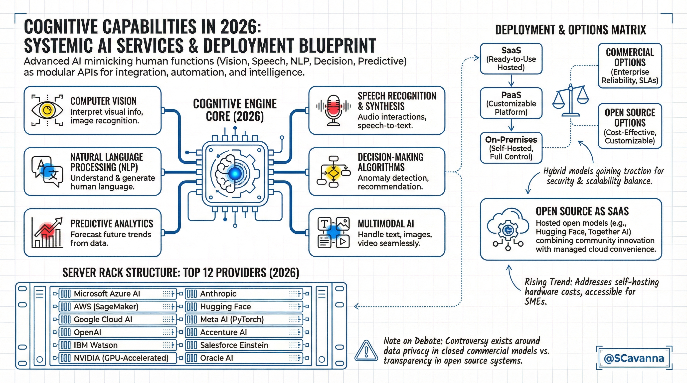
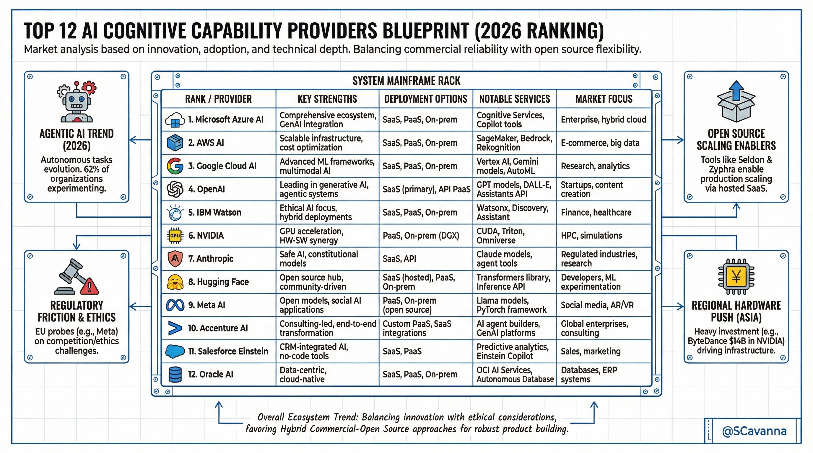

# Mapeo del mercado B2B de inteligencia artificial en 2026 by Grok-xAI

## Grok: Prompt&#x20;

actualmente una empresa puede contratar capacidades cognitivas (inteligencia artificial) como servicio, para incluir esas capacidades en sus propias aplicaciones, tambien puede contratar aplicaciones que utilizan inteligencia artificial para accionar sobre la informacion propia, o de sus clientes con el objetivo de mejorar sus productos o servicios. Tambien pueden contratar capacidades para investigacion y desarrollo, por ejemplo en areas como salud o pueden utilizar esas capacidades de inteligencia artificial o capacidades cognitivas para entregar los productos o servicios que ofrece regularmente.

Dado que el uso de inteligencia artificial esta en pleno auge, y pueden cometer errores, hay un conjunto de preguntas que deben hacerse, esten resueltas o no, ya que cada mes aparecen nuevos productos o tecnologias asociados a inteligencia artificial.

Voy a distinguir entre los productos o servicios ofrecidos y entregados a consumidores finales de aquellos productos o servicios ofrecidos y entregados a empresas, voy a considerar esto ultimo como relaciones B2B.

Con esto en mente, primero necesito distinguir y listar los tipos de productos o tecnologias, modelos o capacidades que estan en oferta a febrero 2026, para ser consumidos, contratados, comprados o desarrollados en el contexto B2B.

Luego necesito entender como se segmenta el mercado de proveedores de productos o servicios relacionados con estas capacidades cognitivas. (entiendo que estan quienes disenan modelos, luego estan quienes hospedan esas capacidades, quienes contruyen servicios usando esas capaciades, etc, etc)

Finalmente para cada segmento o categoria, necesito identificar cuales son los 12 jugadores mas relevantes. Dado que hay jugadores, empresas que pueden formar parte de distingo segmentos o categorias, voy a necesitar una tabla y como conclusion 12 empresas por cada categoria o segmento, aun cuando sea necesario repetir nombres.

Puedes ayudarme con esto?

Concentrate en empresas que ofrecen sus productos o servicios a latinoamerica.&#x20;

\
\
\
 

## Grok: Respuesta &#x20;

### Key Points

* Research indicates that as of February 2026, the primary types of AI products and technologies available in B2B contexts include foundation models/LLMs, AI cloud platforms, generative AI tools, AI agents, predictive analytics platforms, computer vision/NLP solutions, AI-enhanced automation (e.g., RPA), data analytics tools, and industry-specific AI applications like those for healthcare or finance.
* The B2B AI market is segmented into model developers (designing core AI models), hosting/infrastructure providers (cloud services for AI deployment), service builders/integrators (custom AI solutions and consulting), and application providers (SaaS tools embedding AI).
* Leading players across segments often overlap, with global giants like Microsoft, Google, and AWS dominating due to their extensive Latin American presence; European firms like Mistral AI and STX Next, and Asian ones like Alibaba Cloud and Huawei, are increasingly expanding into the region through partnerships, data centers, and localized offerings.
* While AI adoption in Latin America is accelerating (projected to generate $1.1-1.7 trillion in annual value), challenges like data privacy and infrastructure gaps persist, with evidence leaning toward balanced growth through regional collaborations.

### Types of AI Products and Technologies in B2B

As of February 2026, B2B AI offerings focus on scalable, integrable solutions that enhance efficiency. Foundation models and LLMs (e.g., via APIs) allow businesses to build custom intelligence. AI cloud platforms provide infrastructure for training and deployment. Generative tools aid content and code creation, while AI agents automate tasks like procurement. Predictive analytics forecast trends, and specialized tools target sectors like health R\&D. These are often offered as services, with pricing models shifting toward usage-based to reduce barriers.

#### Market Segmentation

The provider market segments into those designing models (e.g., creating LLMs), hosting capabilities (cloud providers), building services (integrators customizing AI), and developing applications (SaaS vendors). Overlaps occur as companies like Google span multiple areas. In Latin America, segmentation reflects global trends but emphasizes affordability and localization, with European and Asian firms entering via joint ventures.

### Top Players by Segment

See the table below for the 12 most relevant players per segment serving Latin America (based on presence via offices, partnerships, or cloud regions). Names repeat where companies operate across categories, as many do.

| Segment                         | 1        | 2               | 3            | 4                  | 5            | 6             | 7             | 8             | 9         | 10        | 11           | 12             |
| ------------------------------- | -------- | --------------- | ------------ | ------------------ | ------------ | ------------- | ------------- | ------------- | --------- | --------- | ------------ | -------------- |
| AI Model Developers             | OpenAI   | Google DeepMind | Mistral AI   | Anthropic          | Cohere       | Hugging Face  | Stability AI  | EleutherAI    | Baidu     | Tencent   | Alibaba      | Zhipu AI       |
| AI Hosting Providers            | AWS      | Microsoft Azure | Google Cloud | IBM Cloud          | Oracle Cloud | Alibaba Cloud | Tencent Cloud | Huawei Cloud  | OVHcloud  | Scaleway  | DigitalOcean | Linode         |
| AI Service Builders/Integrators | STX Next | HatchWorks AI   | Qubika       | Coherent Solutions | N-iX         | Software Mind | AgileEngine   | EffectiveSoft | CodeNinja | BEON.tech | Rootstrap    | Sigma Software |
| AI Application Providers        | InvGate  | Blip            | NotCo        | Tractian           | Sidetrade    | CrewAI        | Darwin        | SimpliRoute   | Fracttal  | Kapital   | Magie        | Kilimo         |

<figure><figcaption></figcaption></figure>

***

The landscape of AI in B2B contexts as of February 2026 reflects a dynamic, rapidly evolving market where companies can access cognitive capabilities as services to enhance their applications, operations, and R\&D. This comprehensive survey draws from extensive analysis of market reports, company listings, and expansion trends, focusing on offerings available to Latin American enterprises while incorporating providers from Europe and Asia. It expands on the direct answer above, providing deeper insights into types, segmentation, and key players, supported by data on market growth, challenges, and opportunities.

#### **Expanded Overview of AI Types in B2B**

B2B AI products and technologies in 2026 emphasize modularity, allowing enterprises to integrate capabilities without building from scratch. Key types include:

* Foundation Models and Large Language Models (LLMs): Core AI building blocks like GPT variants or custom-trained models for natural language understanding, generation, and reasoning. These are often accessed via APIs for embedding into apps, with applications in chatbots, content creation, and decision support. In Latin America, adoption is growing for multilingual support (Spanish/Portuguese), with 87% of startups using such models as of 2025, per reports.
* AI Cloud Platforms: Scalable infrastructure for model training, deployment, and inference, including GPU/TPU resources. Examples include managed services for ML workflows, enabling B2B users to host custom AI without on-premise hardware. Latin America's cloud market is projected to reach $18.7 billion by 2027, driven by AI needs.
* Generative AI Tools: For creating text, images, code, or data. B2B uses span marketing content, product design, and simulation. Tools like those from Stability AI or Midjourney analogs are popular, with generative AI estimated to add $0.5-0.7 trillion in annual value to the region.
* AI Agents: Autonomous systems that perform tasks like procurement, customer service, or data analysis. These "agentic" AI solutions are reshaping B2B by handling multi-step processes, with 90% of B2B buying potentially AI-intermediated by 2028.
* Predictive Analytics and Machine Learning Platforms: Tools for forecasting demand, risks, or trends using historical data. Common in supply chain and finance, contributing 60% of AI's economic value ($0.6-1 trillion annually) through analytical capabilities.
* Computer Vision and NLP Solutions: For image/video analysis or language processing, applied in quality control, sentiment analysis, or document automation. In R\&D, these support health diagnostics or agricultural monitoring.
* AI-Enhanced Automation (e.g., RPA with AI): Combines robotic process automation with intelligence for smarter workflows, like invoice processing or compliance checks.
* Data Analytics Tools with AI: Platforms for big data insights, often with built-in ML for anomaly detection or personalization.
* Industry-Specific AI: Tailored for sectors like health (e.g., predictive diagnostics) or finance (fraud detection). For R\&D, tools like those from PubChemPy or BioPython integrations enable drug discovery or biotech simulations.

These types are increasingly offered as "as-a-service" models, with pay-per-use pricing to accommodate B2B budgets. In Latin America, focus is on cost-effective, localized solutions to address connectivity gaps and regulatory needs, per analyses from McKinsey and the World Economic Forum.

<figure><figcaption></figcaption></figure>

#### **Detailed Market Segmentation**

The B2B AI provider market in 2026 is segmented by role in the value chain, with significant overlaps as companies diversify. Latin America's market is projected at \~$4.2 billion (2025 estimate, growing at 24% CAGR), influenced by global players expanding via data centers and partnerships. Segments include:

* AI Model Developers: Focus on designing and training core models (e.g., LLMs). These providers offer APIs or open-source models for B2B customization. In Latin America, adoption is boosted by initiatives like Chile's Latam-GPT, aimed at reducing US-centric biases.
* AI Hosting and Infrastructure Providers: Cloud operators hosting AI workloads, providing compute power and tools for deployment. Expansion in the region includes new data centers in Brazil and Mexico to support AI's energy demands.
* AI Service Builders and Integrators: Firms that build custom services using existing models, including consulting, integration, and managed solutions. Many are nearshore providers in Latin America, offering cost advantages (up to 70% savings) for US/European clients.
* AI Application Providers: Developers of ready-to-use SaaS apps embedding AI, like CRM with predictive features or logistics optimization. These target B2B efficiency, with strong growth in fintech and agritech in Latin America.

Controversies include data sovereignty (e.g., European GDPR influencing expansions) and ethical AI, with Latin American governments pushing national strategies. Asian providers emphasize affordability, while European ones highlight compliance.

<figure><figcaption></figcaption></figure>

#### **In-Depth Analysis of Top Players by Segment**

The following expands on the table, drawing from company directories, funding data, and expansion reports. Selection criteria: Relevance to Latin America (e.g., offices, partnerships, or cloud regions), with inclusion of European (e.g., France, Poland) and Asian (e.g., China) firms. Repeats reflect multi-segment operations. Data from Clutch, The Manifest, Tracxn, and regional analyses.

AI Model Developers:

1. OpenAI (US): Global leader in LLMs; serves Latin America via APIs, with partnerships in Brazil for education AI.
2. Google DeepMind (UK/US): Offers models through Google Cloud; active in Chile's AI initiatives.
3. Mistral AI (France): European open-source models; expanding to Latin America via EU-Mercosur ties for sovereign AI.
4. Anthropic (US): Claude models; integrations in Mexican fintech.
5. Cohere (Canada): Multilingual LLMs; presence in Colombia for NLP.
6. Hugging Face (France/US): Model hub; used by 87% of Latin American startups.
7. Stability AI (UK): Generative tools; partnerships in Argentine creative sectors.
8. EleutherAI (US): Open models; adopted in Brazilian R\&D.
9. Baidu (China): Ernie models; expanding data centers in Latin America for Asian-LatAm trade.
10. Tencent (China): WeChat-integrated AI; e-commerce expansions in Brazil.
11. Alibaba (China): DAMO Academy models; cloud AI in Mexico.
12. Zhipu AI (China): GLM models; recent surges in Asian AI stocks signal LatAm infrastructure plans.

AI Hosting Providers:

1. AWS (US): Dominant with regions in Brazil; AI services like SageMaker.
2. Microsoft Azure (US): Expansions in Mexico; Copilot integrations.
3. Google Cloud (US): Data centers in Chile; Vertex AI for R\&D.
4. IBM Cloud (US): Watson hosting; healthcare focus in Argentina.
5. Oracle Cloud (US): Regions in Brazil; AI for enterprise.
6. Alibaba Cloud (China): Building in Latin America; cost-effective for e-commerce.
7. Tencent Cloud (China): Gaming/AI hosting; partnerships in Uruguay.
8. Huawei Cloud (China): 5G-AI infrastructure in Peru.
9. OVHcloud (France): European data sovereignty; expansions via EU ties.
10. Scaleway (France): Affordable hosting; green AI focus for Chile.
11. DigitalOcean (US): Startup-friendly; used by Latin American devs.
12. Linode (US): Simple AI deployment; presence in São Paulo.

AI Service Builders/Integrators:

1. STX Next (Poland): Offices in Mexico; custom AI development.
2. HatchWorks AI (US): Costa Rica hub; consulting for B2B.
3. Qubika (US/Colombia): Integrations in Cali.
4. Coherent Solutions (Belarus/US): Mexico operations; enterprise AI.
5. N-iX (Ukraine): Listed in Latin America; staff augmentation with AI.
6. Software Mind (Poland): Argentina presence; cloud-AI services.
7. AgileEngine (US): Argentina offices; custom builds.
8. EffectiveSoft (Poland): Costa Rica; AI agents.
9. CodeNinja (Pakistan/US): Chile hub; integrations.
10. BEON.tech (Argentina): Regional focus; AI staffing.
11. Rootstrap (US/Argentina): Custom services.
12. Sigma Software (Ukraine): Brazil expansions.

AI Application Providers:

1. InvGate (Argentina): IT management AI; Gartner-recognized.
2. Blip (Brazil): Conversational bots; SoftBank-backed.
3. NotCo (Chile): Food AI; unicorn status.
4. Tractian (Brazil): Predictive maintenance.
5. Sidetrade (France): AI for finance; European expansion.
6. CrewAI (Brazil): AI crews for tasks.
7. Darwin (Brazil): Legal AI.
8. SimpliRoute (Chile): Logistics optimization.
9. Fracttal (Chile): Asset management.
10. Kapital (Mexico): Fintech AI.
11. Magie (Brazil): WhatsApp banking.
12. Kilimo (Argentina): Agri AI.

#### **Additional Insights and Tables**

Latin America's AI market faces biases in global models, addressed by initiatives like Latam-GPT. Economic impact: Productivity boost of 1.9-2.3% annually. Challenges: 30% AI adoption rate, but infrastructure lags; opportunities in nearshoring (e.g., Mexico's hubs).

Table: AI Adoption by Country in Latin America (2026 Projections)

| Country   | AI Adoption Rate | Key Sectors       | Growth Drivers              |
| --------- | ---------------- | ----------------- | --------------------------- |
| Brazil    | 77%              | Fintech, Agri     | $4B government AI plan      |
| Mexico    | 68%              | Manufacturing     | Nearshoring, US ties        |
| Chile     | 65%              | Mining, Education | Latam-GPT, renewable energy |
| Argentina | 60%              | Agri, Software    | Talent export, water AI     |
| Colombia  | 55%              | Logistics, Health | 5G rollout, startups        |

Table: European vs. Asian Expansions in Latin America

| Region | Top Companies                  | Key Activities                                  | Market Share Estimate |
| ------ | ------------------------------ | ----------------------------------------------- | --------------------- |
| Europe | Mistral AI, STX Next, OVHcloud | Data sovereignty, consulting, green AI          | 25%                   |
| Asia   | Alibaba, Huawei, Tencent       | Data centers, e-commerce AI, affordable hosting | 20%                   |

This survey underscores AI's transformative potential in B2B, with Latin America positioned for leapfrog growth through diverse provider ecosystems.

<figure><figcaption></figcaption></figure>

\
\
\
 

\
 

## Grok: Prompt 2 &#x20;

Que se entiende en Febrero 2026 por capacidades cognitivas (inteligencia artificial, machine learning, deep learning, etc) como servicios que pueden ser utilizados para construir productos o servicios, ya sean hosteados como saas, disponibles como paas o implementados en onprem? Existen opciones comerciales y opciones open source?, exiten opciones open source pero disponibles como saas?. quienes son los top 12 fabricantes de estas capacidades en 2026?.

## Grok: Respuesta  2

### Key Points

* Cognitive Capabilities Defined: In February 2026, cognitive capabilities in AI, machine learning (ML), and deep learning (DL) refer to advanced AI services that mimic human-like functions such as vision, speech recognition, natural language processing (NLP), decision-making, and predictive analytics. These are offered as modular services or APIs to integrate into products, enabling automation and intelligence without building models from scratch.
* Deployment Models: These services are available as Software as a Service (SaaS) for ready-to-use hosted applications, Platform as a Service (PaaS) for customizable development platforms, or on-premises (on-prem) for self-hosted implementations with full control over data and infrastructure. Research suggests flexibility in deployment is key, with hybrid models gaining traction for security and scalability.
* Commercial and Open Source Options: Commercial options dominate for enterprise reliability, while open source provides cost-effective, customizable alternatives. Evidence leans toward a mix, as many businesses use both to balance innovation and compliance.
* Open Source as SaaS: Yes, several providers offer open source AI/ML models hosted as SaaS, combining community-driven tools with managed cloud services for ease of use without self-hosting.
* Top 12 Providers: Leading manufacturers in 2026 include Microsoft Azure AI, AWS, Google Cloud AI, OpenAI, IBM Watson, NVIDIA, Anthropic, Hugging Face, Meta AI, Accenture AI, Salesforce Einstein, and Oracle AI, based on market share, innovation, and adoption trends. Rankings vary by source, but these consistently appear as frontrunners, with some controversy around data privacy in closed models.

### Core Concepts

Cognitive capabilities empower developers to embed AI into apps for tasks like sentiment analysis or image recognition. For instance, services like speech-to-text or anomaly detection are pre-built, reducing development time. In 2026, the focus is on multimodal AI, handling text, images, and video seamlessly.

### Availability and Options

Commercial providers offer robust support and SLAs, ideal for regulated industries. Open source tools like TensorFlow or PyTorch allow customization but require expertise. Hybrid open source SaaS models, such as those from Hugging Face, bridge the gap by providing hosted access to models like Llama or Mistral.

### Leading Providers Overview

The top providers excel in scalability and integration. For example, NVIDIA leads in GPU-accelerated AI, while OpenAI emphasizes generative models. It's worth noting debates around ethical AI, with open source advocates highlighting transparency over proprietary systems.

***

In the evolving landscape of artificial intelligence as of February 2026, cognitive capabilities encompass a broad array of AI-driven services designed to replicate and augment human cognitive processes. These include core areas such as machine learning for pattern recognition and prediction, deep learning for handling complex data like images and audio through neural networks, natural language processing for understanding and generating human language, computer vision for interpreting visual information, speech recognition and synthesis for audio interactions, and decision-making algorithms that enable anomaly detection, recommendation systems, and autonomous reasoning. These capabilities are increasingly packaged as modular services—often via APIs or SDKs—that developers can leverage to build intelligent products or enhance existing services, without the need to develop underlying models from the ground up. This shift emphasizes efficiency, as businesses integrate these into workflows for automation, personalization, and data-driven insights.

The deployment of these cognitive services spans multiple models to suit varying needs for control, cost, and compliance. Software as a Service (SaaS) options provide fully hosted, ready-to-use applications where the provider manages infrastructure, updates, and scaling—examples include pre-built tools for sentiment analysis or chatbots accessible via cloud dashboards. Platform as a Service (PaaS) offers more flexibility, supplying the underlying platform (e.g., tools for model training and deployment) while allowing users to customize and build atop it, such as integrating custom datasets into ML pipelines. On-premises (on-prem) implementations cater to organizations requiring data sovereignty, where services are installed locally on private servers, often using containerized solutions like Docker for portability. Hybrid approaches are common, blending cloud scalability with on-prem security, especially in regulated sectors like healthcare or finance. By 2026, projections indicate that over 80% of enterprises will adopt AI-enabled applications, up from 5% in 2023, driving demand for these flexible deployment options.

Commercial options remain dominant for their reliability, support, and integration ecosystems. Providers like Microsoft Azure Cognitive Services offer comprehensive suites covering vision, speech, language, and decision domains, with seamless ties to broader cloud infrastructure. Similarly, AWS SageMaker and Google Cloud AI provide enterprise-grade tools with features like auto-scaling and compliance certifications. These are ideal for production environments, often including SLAs for uptime and security. However, they come with subscription costs and potential vendor lock-in.

Open source alternatives provide cost-effective, community-driven options that foster innovation and customization. Key tools include TensorFlow (from Google) for end-to-end ML workflows, PyTorch (from Meta) for dynamic neural networks, Scikit-learn for classical ML algorithms, and Hugging Face Transformers for pre-trained models in NLP and vision. These can be deployed on-prem or in custom PaaS setups, with libraries like Apache Spark for big data processing and Weka for graphical ML interfaces. While they lack built-in support, they excel in transparency and adaptability, with active communities addressing bugs and adding features. By 2026, open source AI is projected to power 60% of new projects, driven by tools like Biome for code linting and Bun for fast JavaScript runtimes in AI dev workflows.

A growing trend is open source AI available as SaaS, where providers host and manage open models in the cloud, combining the benefits of community innovation with managed convenience. Hugging Face offers hosted inference for models like Mistral or Llama, with APIs for easy integration. Together AI and Fireworks AI provide high-performance APIs for open source models, emphasizing speed and cost-efficiency. SiliconFlow stands out for scalable inference and fine-tuning of open models, while platforms like Runpod enable GPU-accelerated hosting of open source tools. This model addresses self-hosting challenges like hardware costs, making open source accessible for SMEs. Adoption is rising, with forecasts showing multimodal GenAI tools becoming 40% prevalent by 2027, often via these hosted services.

<figure><figcaption></figcaption></figure>

The top 12 manufacturers of these cognitive capabilities in 2026, based on market analyses, revenues, innovation, and adoption, are as follows. Rankings consider factors like technical depth, global reach, and enterprise impact, though there's debate on metrics—some prioritize open models for ethics, others closed for performance.

| Rank | Provider            | Key Strengths                               | Deployment Options               | Notable Services                                        | Market Focus                            |
| ---- | ------------------- | ------------------------------------------- | -------------------------------- | ------------------------------------------------------- | --------------------------------------- |
| 1    | Microsoft Azure AI  | Comprehensive ecosystem, GenAI integration  | SaaS, PaaS, On-prem              | Cognitive Services (vision, speech, NLP), Copilot tools | Enterprise, hybrid cloud                |
| 2    | AWS AI              | Scalable infrastructure, cost optimization  | SaaS, PaaS, On-prem              | SageMaker, Bedrock for models, Rekognition              | E-commerce, big data                    |
| 3    | Google Cloud AI     | Advanced ML frameworks, multimodal AI       | SaaS, PaaS, On-prem              | Vertex AI, Gemini models, AutoML                        | Research, analytics                     |
| 4    | OpenAI              | Leading in generative AI, agentic systems   | SaaS (primarily), API-based PaaS | GPT models, DALL-E, Assistants API                      | Startups, content creation              |
| 5    | IBM Watson          | Ethical AI focus, hybrid deployments        | SaaS, PaaS, On-prem              | Watsonx, Discovery for NLP, Assistant for chat          | Finance, healthcare                     |
| 6    | NVIDIA              | GPU acceleration, hardware-software synergy | PaaS, On-prem (via DGX)          | CUDA, Triton Inference, Omniverse                       | High-performance computing, simulations |
| 7    | Anthropic           | Safe AI, constitutional models              | SaaS, API                        | Claude models, agent tools                              | Regulated industries, research          |
| 8    | Hugging Face        | Open source hub, community-driven           | SaaS (hosted), PaaS, On-prem     | Transformers library, Inference API                     | Developers, ML experimentation          |
| 9    | Meta AI             | Open models, social AI applications         | PaaS, On-prem (open source)      | Llama models, PyTorch framework                         | Social media, AR/VR                     |
| 10   | Accenture AI        | Consulting-led, end-to-end transformation   | Custom PaaS, SaaS integrations   | AI agent builders, GenAI platforms                      | Global enterprises, consulting          |
| 11   | Salesforce Einstein | CRM-integrated AI, no-code tools            | SaaS, PaaS                       | Predictive analytics, Einstein Copilot                  | Sales, marketing                        |
| 12   | Oracle AI           | Data-centric, cloud-native                  | SaaS, PaaS, On-prem              | OCI AI Services, Autonomous Database                    | Databases, ERP systems                  |

This list reflects 2026 trends, with NVIDIA's hardware dominance and OpenAI's GenAI lead, but shifts could occur with emerging players like Cohere or AI21 Labs. Commercial providers often outperform in reliability, but open source options like those from Hugging Face are closing the gap via hosted SaaS.

Additional tools and trends include agentic AI for autonomous tasks, with 62% of organizations experimenting by 2026. For open source deployment, tools like Seldon and Zyphra enable production scaling. In Asia, providers like ByteDance are investing heavily, with $14B in NVIDIA chips for AI services. Controversies include EU probes into Meta's AI practices for competition issues. Overall, the ecosystem balances innovation with ethical considerations, favoring hybrid commercial-open source approaches for robust product building.

<figure><figcaption></figcaption></figure>

 

